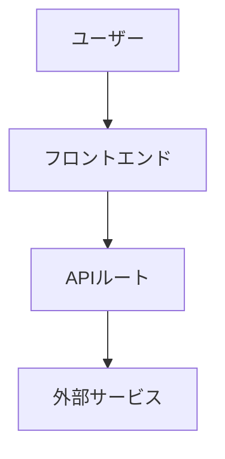

# 機能仕様書テンプレート（Feature Spec）

> 個別機能の要件・設計・タスクを1セットで管理するテンプレート。
> 複製して `docs/requirements/projects/<project_slug>/specs/<feature_slug>.md` に保存する（テンプレは編集しない）。

**全機能に作成する必要はない。** 以下のいずれかに該当する「複雑な機能」にのみ使用する:
- 条件分岐やエラーハンドリングが3パターン以上ある
- 外部サービスとの連携がある（API / CMS / メール送信等）
- 状態管理や非同期処理を含む
- 複数の画面/コンポーネントにまたがる

該当しない機能（静的ページ、単純なレイアウト等）は要件定義書 + SOW で十分。

参考: 仕様駆動開発（SDD）の3フェーズ構造（Requirements → Design → Tasks）を、ツール非依存な1ファイルに統合した形式。

### `[NEEDS CLARIFICATION]` マーカーについて

本テンプレートでは、未確定の項目に `[NEEDS CLARIFICATION: <理由>]` マーカーを使用する。

- **意味**: この項目は未確定であり、推測で埋めてはならない。ユーザーに確認が必要。
- **書き方**: `[NEEDS CLARIFICATION: CMS 未選定。microCMS / Contentful / WordPress API から選択]`
- **TBD との違い**: TBD は「後で決める」（実装開始時に残っていてもよい）。`[NEEDS CLARIFICATION]` は **実装着手前に必ず解消すること**。
- **AIエージェントへ**: 推測で値を埋めるのではなく、このマーカーを使ってユーザーに質問する。

（作成日: 2026-04-13 JST / 更新日: 2026-04-14 JST）

---

## 1. 概要

- **機能名**:
- **機能スラッグ**: （ファイル名に使用。例: `contact-form`, `cms-integration`）
- **関連する要件定義書の項目**: REQUIREMENTS §X
- **関連するSOW**: SOW_<phase>.md §X

---

## 2. 要件（EARS形式）

*EARS（Easy Approach to Requirements Syntax）記法で記述する。記法の詳細は `REQUIREMENTS_TEMPLATE.md` §2.5 を参照。*

### 2.1 ユーザーストーリー

`<ユーザー種別> として、<目的> のために、<機能> したい。`

### 2.2 機能要件

| ID | 要件（EARS形式） | 受入基準 | Must/Should |
|---|---|---|---|
| FR-XXX-001 | WHEN ... THE SYSTEM SHALL ... | テストで検証可能な基準を記述 | Must |
| FR-XXX-002 | IF ..., WHEN ... THE SYSTEM SHALL ... | [NEEDS CLARIFICATION: 条件の詳細をユーザーに確認] | Should |
| FR-XXX-003 | WHEN [不正ケース] THE SYSTEM SHALL ... | | Must |

### 2.2b 受入シナリオ（BDD形式 — 複雑なユーザーシナリオがある場合に使用）

*正常系・異常系の主要シナリオを Given/When/Then 形式で記述する。全シナリオを網羅する必要はなく、**要件の意図を明確にするために有効なシナリオ**を選んで記述する。§2.2 の EARS 形式と併用する。*

**シナリオ1: [正常系シナリオ名]**
- **Given** [初期状態・前提条件]
- **When** [ユーザーの操作・トリガー]
- **Then** [期待される結果]

**シナリオ2: [異常系シナリオ名]**
- **Given** [初期状態]
- **When** [異常操作・エラー条件]
- **Then** [エラー処理・フォールバック]

### 2.3 非機能要件（この機能固有のもの）

| ID | 要件 | 基準値 | Must/Should |
|---|---|---|---|
| NFR-XXX-001 | 例: レスポンスタイム | 例: 2秒以内 / [NEEDS CLARIFICATION: 目標値をユーザーに確認] | Should |

---

## 3. 設計

### 3.0 設計判断の事前チェック（Phase -1 Gate）

*設計に入る前に以下を確認する。過剰設計を防ぎ、要件に対して最小限の設計で実装する。*

- [ ] この複雑さは要件から本当に必要か（YAGNI 原則に照らして）
- [ ] 既存の共通関数・コンポーネント・ライブラリで実現できないか確認した
- [ ] 外部依存は最小限か（代替案を検討したか）
- [ ] `ARCHITECTURE_RULES.md` の疎結合原則に沿っているか
- [ ] セキュリティ規約（`SECURITY_RULES.md`）に影響がないか確認した

### 3.1 アーキテクチャ概要

*コンポーネント構成、データフローを記述。Mermaid図を推奨。*

### 3.2 技術選定と根拠

| 選択 | 理由 | 代替案 | 不採用理由 |
|---|---|---|---|
| | | | |

### 3.3 エラーハンドリング

| エラーケース | 検知方法 | ユーザーへの通知 | リカバリ |
|---|---|---|---|
| | | | |

### 3.4 テスト戦略

- **単体テスト**: 対象コンポーネント/関数
- **統合テスト**: API連携、データフロー
- **E2E**: ユーザーシナリオ

---

## 4. 実装タスク

*離散的・追跡可能なタスクに分解する。各タスクは独立して完了確認できる粒度にする。*

- [ ] タスク1: 
- [ ] タスク2: 
- [ ] タスク3: 
- [ ] タスク4: テスト実装
- [ ] タスク5: 品質ゲート通過確認

---

## 5. 完了確認

- [ ] §2.2 の全 Must 受入基準を満たしている
- [ ] §3.4 のテスト戦略に基づくテストが通過している
- [ ] 品質ゲート（`QUALITY_GATES.md`）通過
- [ ] 要件定義書の対応項目と整合している
- [ ] SOWの受入基準チェックリストの該当項目を `[x]` に更新した
